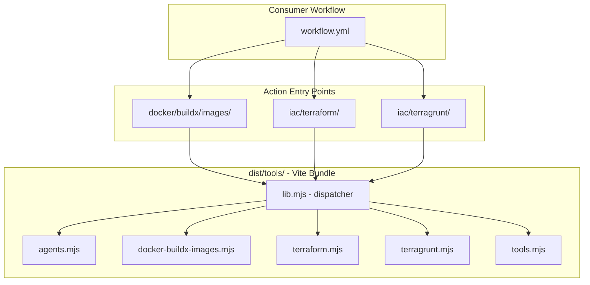
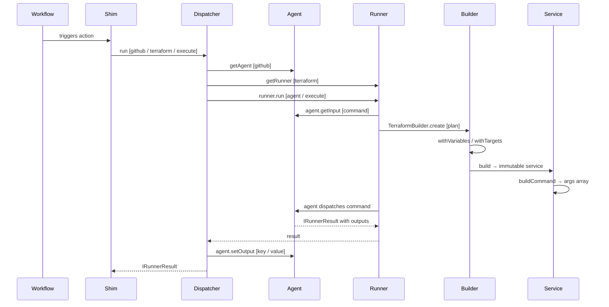

# GitHub Actions

A monorepo of independently invocable GitHub Actions for Docker manifest
creation and Infrastructure as Code (IaC) operations.

## Available Actions

| Action                                                       | Description                                          | Usage                                       |
| ------------------------------------------------------------ | ---------------------------------------------------- | ------------------------------------------- |
| [Docker BuildX ImageTools](./docker/buildx/images/README.md) | Create multi-architecture Docker manifests           | `elioetibr/actions/docker/buildx/images@v1` |
| [Terraform](./iac/terraform/README.md)                       | Execute Terraform commands with a fluent builder API | `elioetibr/actions/iac/terraform@v1`        |
| [Terragrunt](./iac/terragrunt/README.md)                     | Execute Terragrunt commands with run-all support     | `elioetibr/actions/iac/terragrunt@v1`       |

## Quick Start

```yaml
# Docker BuildX ImageTools
- uses: elioetibr/actions/docker/buildx/images@v1
  with:
    ecrRegistry: ${{ steps.ecr-login.outputs.registry }}
    ecrRepository: my-app
    semVer: '1.0.0'

# Terraform
- uses: elioetibr/actions/iac/terraform@v1
  with:
    command: plan
    working-directory: ./infrastructure

# Terragrunt
- uses: elioetibr/actions/iac/terragrunt@v1
  with:
    command: plan
    working-directory: ./infrastructure
    run-all: 'true'
```

## Architecture

Follows the [GitTools/actions](https://github.com/GitTools/actions) monorepo
pattern: each action has a thin `main.mjs` shim that imports from a shared
compiled library.



### Request Lifecycle



### Repository Layout

```
elioetibr/actions/
├── docker/buildx/images/     # Consumer-facing action
│   ├── action.yml            # GitHub Action definition (node24)
│   ├── main.mjs              # Thin shim -> dist/tools/lib.mjs
│   └── README.md
├── iac/terraform/            # Consumer-facing action
│   ├── action.yml
│   ├── main.mjs
│   └── README.md
├── iac/terragrunt/           # Consumer-facing action
│   ├── action.yml
│   ├── main.mjs
│   └── README.md
├── dist/tools/               # Compiled bundles (Vite, committed)
│   ├── lib.mjs               # Central run() dispatcher
│   └── libs/                 # Code-split chunks
├── src/                      # Development source
│   ├── actions/              # Builder + Service implementations
│   ├── agents/               # CI/CD agent abstraction (IAgent)
│   ├── tools/                # Tool runners + lib.ts entry
│   └── libs/                 # Shared utilities, formatters, services
├── Makefile                  # Release automation (GitVersion + git-cliff)
└── docs/                     # Architecture & release documentation
```

For a detailed deep-dive into the layered architecture, design patterns, and
build pipeline, see [Architecture Documentation](./docs/architecture.md).

## Versioning

Uses [GitVersion](https://gitversion.net/) with
[conventional commits](https://www.conventionalcommits.org/) for semantic
versioning. Pin at any granularity:

```yaml
uses: elioetibr/actions/iac/terraform@v1       # Latest v1.x.x (recommended)
uses: elioetibr/actions/iac/terraform@v1.2     # Latest v1.2.x
uses: elioetibr/actions/iac/terraform@v1.2.3   # Exact version
```

Floating tags (`v1`, `v1.2`) and branches are updated on every release. See
[Release Process](./docs/release-process.md) for details.

## Development

### Prerequisites

- Node.js >= 24.0.0 (actions run on `node24`)
- pnpm

### Commands

```bash
# Build (Vite -> dist/tools/)
pnpm run build

# Testing
pnpm test
pnpm run test:coverage
pnpm run test:watch

# Code Quality
pnpm run lint
pnpm run lint:fix
pnpm run format
pnpm run typecheck

# Full verification
make verify          # lint + typecheck + test + build

# Release (requires gitversion, git-cliff, gh)
make release         # Full pipeline: verify -> version -> changelog -> tag -> release
```

### Design Principles

- **SOLID** - Single Responsibility, Open/Closed, Liskov Substitution, Interface
  Segregation, Dependency Inversion
- **DRY** - Shared parsers and utilities in `src/libs/`
- **KISS** - Each action is a focused, single-purpose entry point
- **Builder + Factory** - Fluent API for command construction
- **Agent Abstraction** - `IAgent` interface decouples tool logic from CI/CD
  platform
- **Layered Architecture** - Clear separation between builders, services, and
  interfaces

## Documentation

| Document                                                     | Description                                               |
| ------------------------------------------------------------ | --------------------------------------------------------- |
| [Architecture](./docs/architecture.md)                       | Layered design, patterns, build pipeline, extending guide |
| [Release Process](./docs/release-process.md)                 | GitVersion + git-cliff release pipeline                   |
| [Docker BuildX ImageTools](./docker/buildx/images/README.md) | Multi-arch Docker manifest action                         |
| [Terraform](./iac/terraform/README.md)                       | Terraform action with builder API                         |
| [Terragrunt](./iac/terragrunt/README.md)                     | Terragrunt action with run-all support                    |
