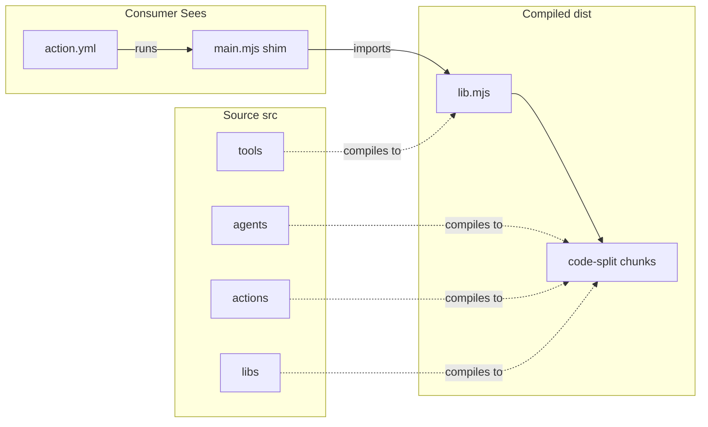
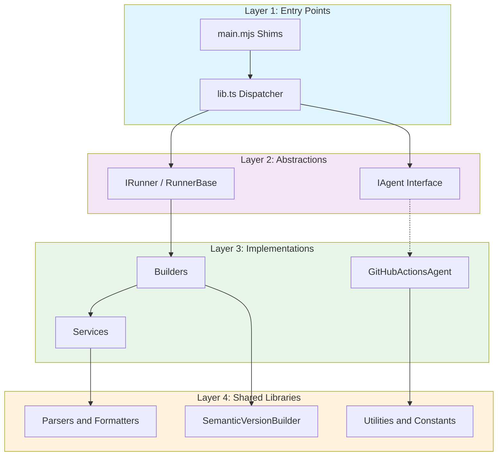
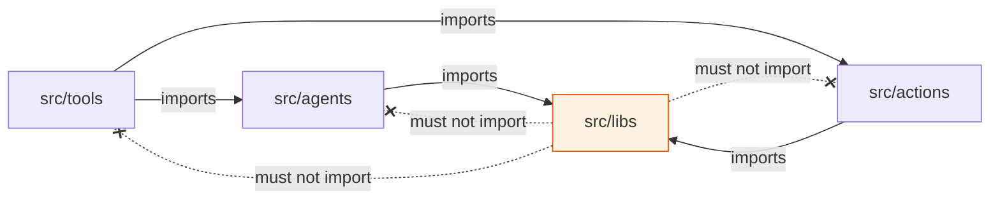
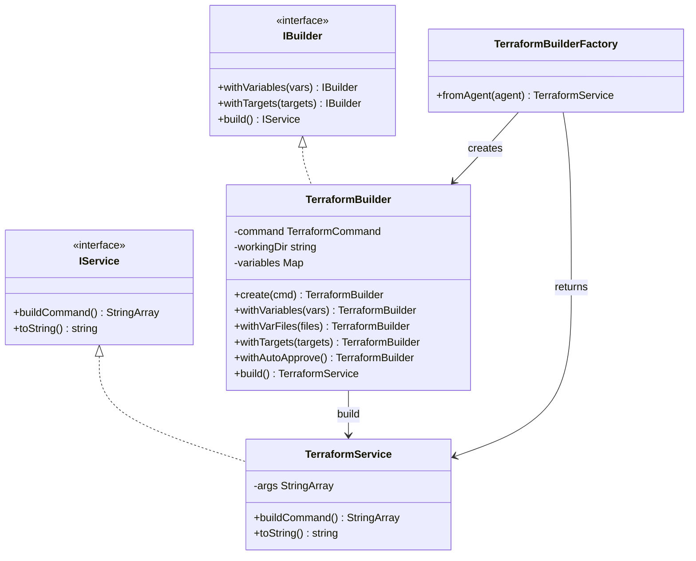
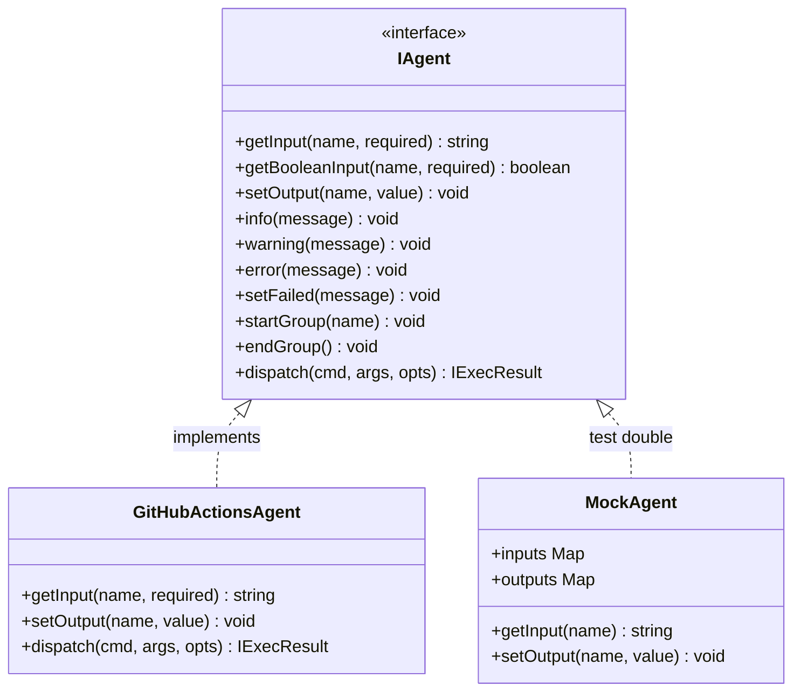
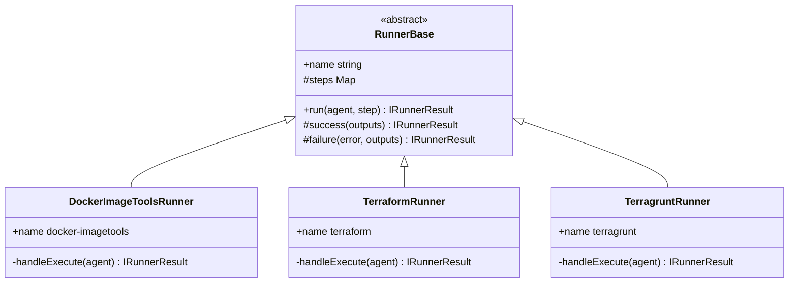
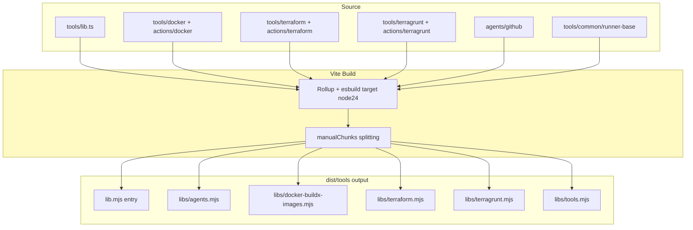
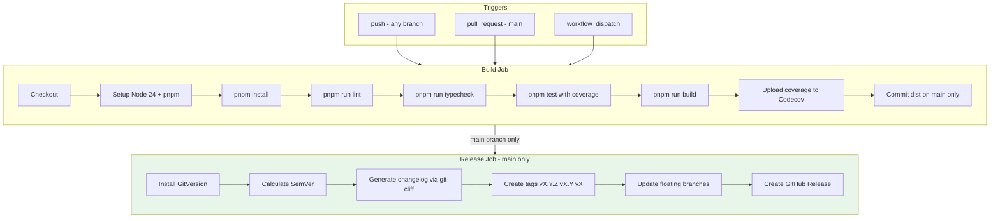
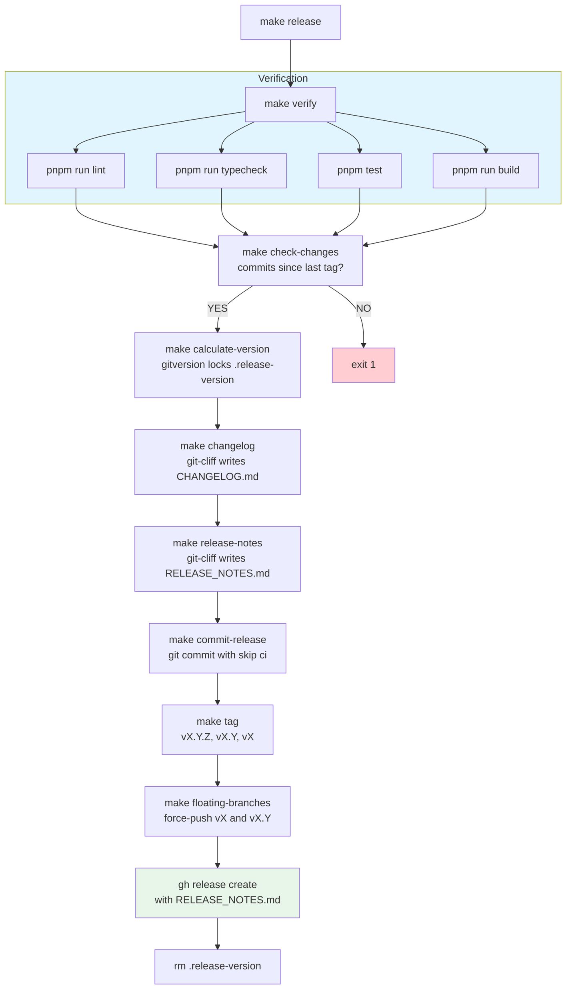
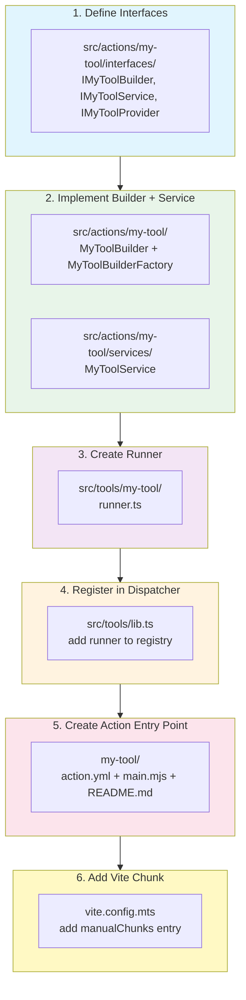

# Architecture

Deep-dive into the design, patterns, and build pipeline of `elioetibr/actions`.

## Table of Contents

- [Overview](#overview)
- [Layered Architecture](#layered-architecture)
- [Design Patterns](#design-patterns)
- [Build Pipeline](#build-pipeline)
- [CI/CD Workflow](#cicd-workflow)
- [Release Pipeline](#release-pipeline)
- [Action Reference](#action-reference)
- [Extending the Project](#extending-the-project)

## Overview

This monorepo provides three GitHub Actions that share a common compiled library. It follows the [GitTools/actions](https://github.com/GitTools/actions) monorepo pattern where consumer-facing directories contain only a thin shim (`main.mjs`) that delegates to compiled code in `dist/`.



Each action shim is just two lines:

```javascript
import { run } from '../../../dist/tools/lib.mjs'
await run('github', 'terraform', 'execute')
```

## Layered Architecture

The codebase separates concerns into four layers. Each layer only depends on layers below it.



### Layer Descriptions

| Layer | Directory | Responsibility |
|-------|-----------|---------------|
| **Entry Points** | `src/tools/lib.ts`, `*/main.mjs` | Central dispatcher; maps agent/runner names to factories |
| **Abstractions** | `src/agents/interfaces.ts`, `src/tools/common/` | Platform-agnostic contracts for agents and runners |
| **Implementations** | `src/agents/github/`, `src/actions/*/` | GitHub Actions agent, Builder + Service for each tool |
| **Shared Libraries** | `src/libs/` | Parsers, formatters, version handling, constants |

### Dependency Rules



`src/libs/` is a leaf dependency. It must never import from `src/actions/`, `src/agents/`, or `src/tools/`.

## Design Patterns

### Builder + Factory Pattern

Each action uses a **Fluent Builder** for configuration and produces an **Immutable Service** that constructs command arguments.



**Why this pattern?** The Builder allows flexible configuration via a fluent API. Once `.build()` is called, the resulting Service is immutable — the command args cannot be accidentally modified. The Factory (`fromAgent()`) bridges the IAgent input-reading interface with the Builder.

### Agent Abstraction (Strategy Pattern)

The `IAgent` interface decouples all tool logic from GitHub Actions specifics. This enables:

- Unit testing with mock agents (no `@actions/core` dependency)
- Future support for GitLab CI, Azure Pipelines, or local CLI



### Runner Step Dispatch (Template Method)

Each tool runner extends `RunnerBase` and registers steps in a `Map`. The base class handles dispatch, error wrapping, and provides `success()`/`failure()` helpers.



## Build Pipeline

[Vite](https://vitejs.dev/) bundles `src/tools/lib.ts` into self-contained ESM output. All npm dependencies (`@actions/core`, `@actions/io`, etc.) are bundled; only Node.js built-in modules are externalized.



### Code Splitting Strategy

The `manualChunks` function in `vite.config.mts` splits modules by tool:

| Module Path Contains | Chunk Name | Output File |
|---------------------|------------|-------------|
| `src/tools/docker/` | docker-buildx-images | `libs/docker-buildx-images.mjs` |
| `src/tools/terraform/` | terraform | `libs/terraform.mjs` |
| `src/tools/terragrunt/` | terragrunt | `libs/terragrunt.mjs` |
| `src/tools/common/` | tools | `libs/tools.mjs` |
| `src/agents/` | agents | `libs/agents.mjs` |

This ensures each action only loads the chunks it needs at runtime.

### Externalization

Only Node.js 24 built-in modules are externalized (not bundled). The `sea` module is filtered out since it does not exist in the GitHub Actions Node 24 runtime.

```
node24Builtins = builtinModules.filter(m => !m.includes('sea'))
```

## CI/CD Workflow

The CI pipeline runs on every push and pull request. On pushes to `main`, it also triggers the release job.



### Concurrency Control

The workflow uses GitHub's concurrency groups:

- **`main` branch**: new pushes queue (don't cancel in-progress builds)
- **Pull requests**: new pushes cancel previous runs to save resources
- **Different PRs**: run in parallel

## Release Pipeline

The Makefile automates the full release process using GitVersion + git-cliff + GitHub CLI.



The `.release-version` file locks the version calculated in step 3. All subsequent steps read from this file to prevent version drift after the commit-release step adds a new commit.

See [Release Process](./release-process.md) for the full step-by-step guide.

## Action Reference

### Docker BuildX ImageTools

Creates multi-architecture Docker manifests from AMD64 and ARM64 images.

```yaml
- uses: elioetibr/actions/docker/buildx/images@v1
  with:
    ecrRegistry: ${{ steps.ecr-login.outputs.registry }}
    ecrRepository: my-app
    amd64MetaTags: 'sha-abc1234-amd64'
    arm64MetaTags: 'sha-abc1234-arm64'
    manifestMetaTags: 'latest,v1.0.0'
    manifestMetaAnnotations: 'org.opencontainers.image.source=https://github.com/...'
    semVer: '1.0.0'
```

**Key inputs:** `ecrRegistry`, `ecrRepository`, `amd64MetaTags`, `arm64MetaTags`, `manifestMetaTags`, `manifestMetaAnnotations`, `semVer`, `dryRun`

**Key outputs:** `imageUri`, `buildXArgs`, `major`, `minor`, `patch`, `fullVersion`

See [Docker BuildX ImageTools README](../docker/buildx/images/README.md) for full documentation.

### Terraform

Runs Terraform commands with a fluent builder API.

```yaml
- uses: elioetibr/actions/iac/terraform@v1
  with:
    command: plan
    working-directory: ./infrastructure
    variables: '{"environment": "production"}'
    var-files: 'common.tfvars,prod.tfvars'
    targets: 'module.vpc,module.eks'
```

**Supported commands:** `init`, `validate`, `fmt`, `plan`, `apply`, `destroy`, `output`, `show`

**Key inputs:** `command`, `working-directory`, `variables`, `var-files`, `backend-config`, `targets`, `auto-approve`, `plan-file`, `parallelism`, `dry-run`

**Key outputs:** `command`, `command-args`, `command-string`, `exit-code`, `stdout`, `stderr`

See [Terraform README](../iac/terraform/README.md) for full documentation.

### Terragrunt

Runs Terragrunt commands with `run-all` support for multi-module operations.

```yaml
- uses: elioetibr/actions/iac/terragrunt@v1
  with:
    command: plan
    working-directory: ./infrastructure
    run-all: 'true'
    terragrunt-parallelism: '4'
    include-dirs: 'modules/vpc,modules/eks'
```

**Supported commands:** `init`, `validate`, `fmt`, `hclfmt`, `plan`, `apply`, `destroy`, `output`, `graph-dependencies`, `validate-inputs`

**Key inputs:** All Terraform inputs plus `run-all`, `terragrunt-config`, `terragrunt-parallelism`, `include-dirs`, `exclude-dirs`, `iam-role`, `source-map`, `strict-include`

**Key outputs:** `command`, `command-args`, `command-string`, `exit-code`, `stdout`, `stderr`

See [Terragrunt README](../iac/terragrunt/README.md) for full documentation.

## Extending the Project

### Adding a New Action

Follow these steps to add a new action to the monorepo.



#### Step 1: Define Interfaces

```
src/actions/my-tool/
├── interfaces/
│   ├── IMyToolBuilder.ts     # Builder fluent API contract
│   ├── IMyToolService.ts     # Immutable service contract
│   ├── IMyToolProvider.ts    # Input provider contract
│   └── index.ts              # Barrel exports
```

#### Step 2: Implement Builder + Service

```typescript
// src/actions/my-tool/MyToolBuilder.ts
class MyToolBuilder implements IMyToolBuilder {
  static create(command: string): MyToolBuilder { ... }
  withOption(value: string): MyToolBuilder { ... }  // fluent API
  build(): MyToolService { ... }                    // returns immutable service
}

// src/actions/my-tool/services/MyToolService.ts
class MyToolService implements IMyToolService {
  buildCommand(): string[] { ... }  // returns command arguments
  toString(): string { ... }        // human-readable representation
}
```

#### Step 3: Create Runner

```typescript
// src/tools/my-tool/runner.ts
class MyToolRunner extends RunnerBase {
  readonly name = 'my-tool';
  protected readonly steps = new Map([
    ['execute', (agent: IAgent) => this.handleExecute(agent)],
  ]);
}
```

#### Step 4: Register in Dispatcher

Add the runner to the registry in `src/tools/lib.ts`:

```typescript
const runners: Map<string, RunnerFactory> = new Map([
  // ... existing runners
  ['my-tool', createMyToolRunner],
]);
```

#### Step 5: Create Action Entry Point

```yaml
# my-tool/action.yml
name: 'My Tool Action'
runs:
  using: 'node24'
  main: 'main.mjs'
```

```javascript
// my-tool/main.mjs
import { run } from '../dist/tools/lib.mjs'
await run('github', 'my-tool', 'execute')
```

#### Step 6: Add Vite Chunk

In `vite.config.mts`, add to `manualChunks`:

```typescript
if (id.includes('src/tools/my-tool/')) return 'my-tool';
```

### Adding a New CI/CD Platform Agent

To support a platform other than GitHub Actions:

1. Implement the `IAgent` interface in `src/agents/my-platform/agent.ts`
2. Register it in `src/tools/lib.ts` under the `agents` map
3. Create a new shim that calls `run('my-platform', ...)` instead of `run('github', ...)`

No changes to runners, builders, or services are needed — they only depend on the `IAgent` interface.

## Testing Strategy

Tests are co-located with source files (`*.test.ts`). The project enforces 90% coverage thresholds.

```
src/actions/docker/buildx/images/
├── DockerBuildXImageToolsBuilder.ts
├── DockerBuildXImageToolsBuilder.test.ts      # Unit tests
├── DockerBuildXImageToolsBuilderFactory.ts
├── DockerBuildXImageToolsBuilderFactory.test.ts
├── __mocks__/                                  # Test mocks
│   └── DockerBuildXImageToolsServiceMock.ts
└── examples/                                   # Usage examples
    └── DockerBuildXImageToolsBuilder.examples.ts
```

### Testing Layers

| Layer | What to Test | How |
|-------|-------------|-----|
| Builders | Fluent API, argument construction | Direct instantiation, assert `buildCommand()` output |
| Services | Command string formatting | Direct instantiation with known args |
| Runners | Step dispatch, error handling | Mock `IAgent`, verify outputs |
| Factories | Input-to-builder mapping | Mock `IAgent.getInput()`, verify service output |
